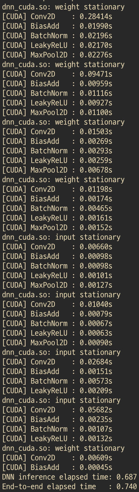
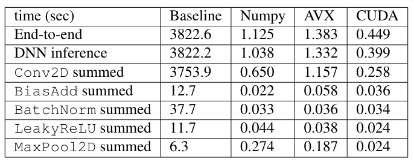
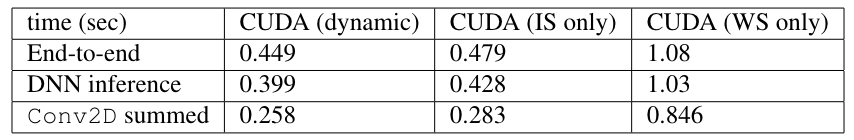
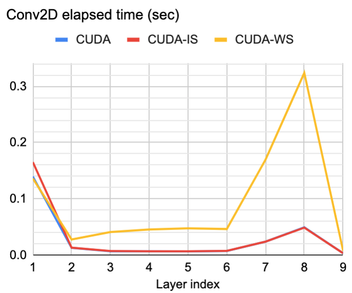
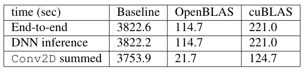

# Offloaded DNN Inference
- Model: YOLOv2-tiny

  

**How to run**
- Locate into proj3/src/
- Set wanted library at line 5 of `yolov2tiny.py` (`from [dnn/dnn_vec/dnn_avx/dnn_cuda] import ...`)
- `make all`
- `python3 __init__.py [in_image] [out_image] [-DEBUG/NDEBUG]`
- Debug mode for correctness check and runtime print: `python3 -d ...`

**Results: Heavy optimization**
- Baseline: Naive scalar operations / Fully vectorized NumPy
- AVX (CPU): Thread-level and instruction-level parallelization
- CUDA (GPU): Dynamic switching between input stationary and weight stationary dataflow

  

**Ablation Study**
- Dynamic switching helps!

  

  

***Results: Light***
- Baseline: Naive scalar operations
- OpenBLAS / cuBLAS

  

