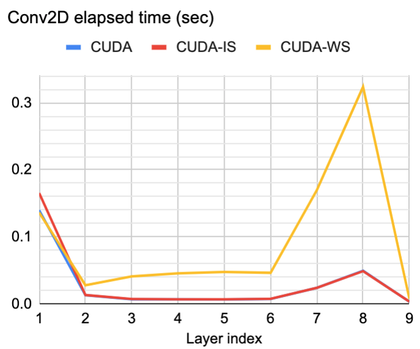

# Run object detection faster than numpy
- Model: YOLOv2-tiny

**Baselines**
- Naive scalar operations
- Fully vectorized NumPy

**CPU optimization**
- OpenBLAS
- AVX (main): Runs 1.2x to NumPy

**GPU optimization**
- cuBLAS
- CUDA (main): Runs 2.5x faster to NumPy, Dynamic switching between input stationary and weight stationary dataflow
